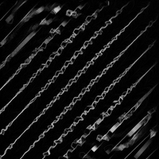
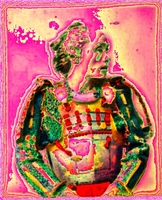
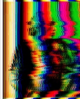

# clojure2d [](https://travis-ci.org/Clojure2D/clojure2d)

Clojure2D is a library supporting generative coding or glitching. It's based on Java2D directly. It's Clojure only, no ClojureScript version.








## Documentation

[Codox - In progress!](https://clojure2d.github.io/clojure2d/docs/codox/)

## Motivation

This project is the answer to personal needs to optimize my own workflow for generative or glitch creations. I've been producing a lot of Processing code and started to suffer from limitations of working in 'write sketch and run' mode. Too much copy&paste between sketches, zillions of folders, zillions of processed images. And one day I fell in love with FP. This code is the answer.

### What's wrong with Processing?

* not reusable code - you have to copy your common parts between sketches
* display and canvas coupling
* weak or no support for parallelism
* more minor...

### Is it replacement for...

... quil, thi.ng, clisk, possibly other?

No, rather no. The closest is quil, which is really great library (both Clojure and Clojurescript, great documentation and webpage, functional mode, 3d support etc.).
`Clojure2d` emphasises math, color and pixels operations and adds a lot of ready to use effects/filters (see `extra` namespaces`).

### What's special in this library then?

In points:

* Almost decoupled display and canvas (decoupled drawing and refreshing) - you can have as many windows as you want, you can have as many canvases as you want. Display repaints selected canvas automaticaly in separate thread. This way you can operate on canvas in your pace.
* Processing way is still possible (you can attach draw() function to your Display). However main benefit here: draw function keeps context between invocations, this way you can avoid global state (atoms etc.) and write more functional way. The same is for events, each Window has assigned state which is passed through event calls.
* Easy live coding possible (Emacs/Cider/REPL)
* FastMath as main math library
* Main focus on higher level generative/glitch concepts (like sonification support, vector field functions, colorspace operations, things like pixelsorting, slitscan etc. See my Processing sketches, link below)

Check out examples and results folders

### What's odd?

It's kind of personal library which supports my (probably not optimal, not convenient for others) way of creating stuff.
There are still plenty of bugs and not idiomatic code. It may be slower than Processing. Eats a lot of memory (Pixels code is generally immutable). Still not stable API and architecture.
No tests (yet)

## Installation

Add following line as a dependency to your `project.clj`

```clojure
[clojure2d "0.0.7-SNAPSHOT"]
```

## Usage

Since still no tutorials are available, check out prepared examples. All namespaces are described below.

### clojure2d.core [docs](https://clojure2d.github.io/clojure2d/docs/codox/clojure2d.core.html)

This is main namespace with functions in three groups:

* image file oparations (load/save); jpg, png and bmp
* canvas operations (wrapper for Java2D BufferedImage and Graphics2D)
* window and event operations (JFrame wrapper)
* global state (one per window)
* session handling (logger + unique, sequential filename generator)

### clojure2d.pixels [docs](https://clojure2d.github.io/clojure2d/docs/codox/clojure2d.pixels.html)

Pixels type as a representation of channel values of the image plus operations on pixels.
Defines also:

* pixel filters (blur, erode, dilate, median, threshold, posterize, tint)
* composing Pixels
* higher order functions which operate on Pixels parallelly (filter-channels, blend-channels)
* accumulation bins (smooth rendering canvas)

### clojure2d.color [docs](https://clojure2d.github.io/clojure2d/docs/codox/clojure2d.color.html)

* colorspace converters
* collection of blending basic functions (like add, subtract, divide, difference, etc.)
* palette generation / color reducing filter

### clojure2d.extra

This is namespace for common generative/glitch specific libraries:

* signal - signal processing, wave generators, effects and filters (sonification enabler) [docs](https://clojure2d.github.io/clojure2d/docs/codox/clojure2d.extra.signal.html)
* overlays - 3 overlays (noise, spots and rgb scanlines) to finish your images [docs](https://clojure2d.github.io/clojure2d/docs/codox/clojure2d.extra.overlays.html)
* segmentation - segment Pixels into rectangles [docs](https://clojure2d.github.io/clojure2d/docs/codox/clojure2d.extra.segmentation.html)
* variations - vector field functions / variations taken from fractal flames world [docs](https://clojure2d.github.io/clojure2d/docs/codox/clojure2d.extra.variations.html)
* glitch - glitching filters
* raymarching - simple ray marching 3d scene renderer

### generateme/fastmath

All math functions are in [fastmath](https://github.com/generateme/fastmath) repository.

## Examples

200+ examples are in separate repository

[EXAMPLES](https://github.com/Clojure2D/clojure2d-examples)

## TODO

### High priority

* ~~Marginalia docs + github.io page - in progress~~
* Cleaning, optimizations - still in progress (more profiling, boxed math removal)
* ~~Parallel color operations on Pixels~~
* ~~Color namespace cleaning~~
* ~~Colorspace converters~~
* More in extra ns:
  - SDF objects
  - variations
  - glitch filters in extra namespace (moved from Processing)
  - analog filters (for sonification part)
* More canvas drawing functions (PShape implementation - partially done)
* ~~Session handling (saving results in session, logging actions) - done, not tested~~
* Sanity tests
* Tutorials

### Low priority or ideas

* Cheat sheet
* ~~More window events~~
* Deeper joise bindings
* Wavelets bindings
* Tests... (in progress)

## Community

[Clojurians](https://clojurians.slack.com/archives/clojure2d)

### How to support

Yes! You can help with this project:

* Beginners:
  - create more variations
  - ~~create colorspace converters~~
  - create pixel filters
  - create analog (audio) filters
* Advanced:
  - speed optimizations
  - idiomatic clojure fixes

Discuss about it with me on Slack.
Or just Pull Request.

## Projects / links

* [Processing glitch/generative projects](https://github.com/tsulej/GenerateMe)
* [Visual log](http://generateme.tumblr.com)
* [Folds project](http://folds2d.tumblr.com)
* [Articles](https://generateme.wordpress.com)
* [Facebook 1](https://www.facebook.com/generateme)
* [Facebook 2](https://www.facebook.com/folds2d)
* [Twitter](https://twitter.com/generateme_blog)

## License

Copyright © 2016-2017 GenerateMe
Distributed under the MIT Licence
